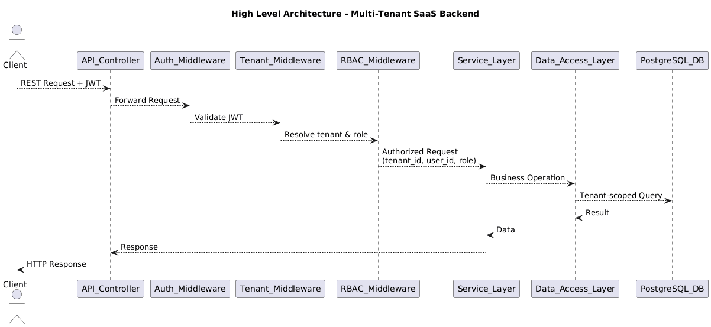
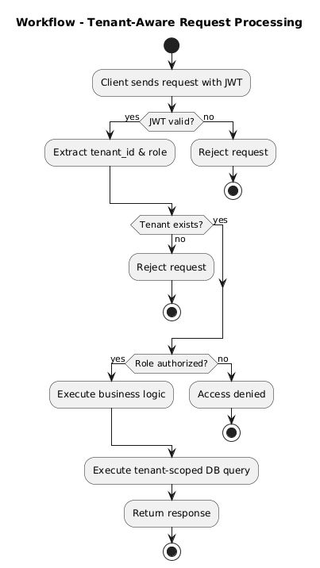
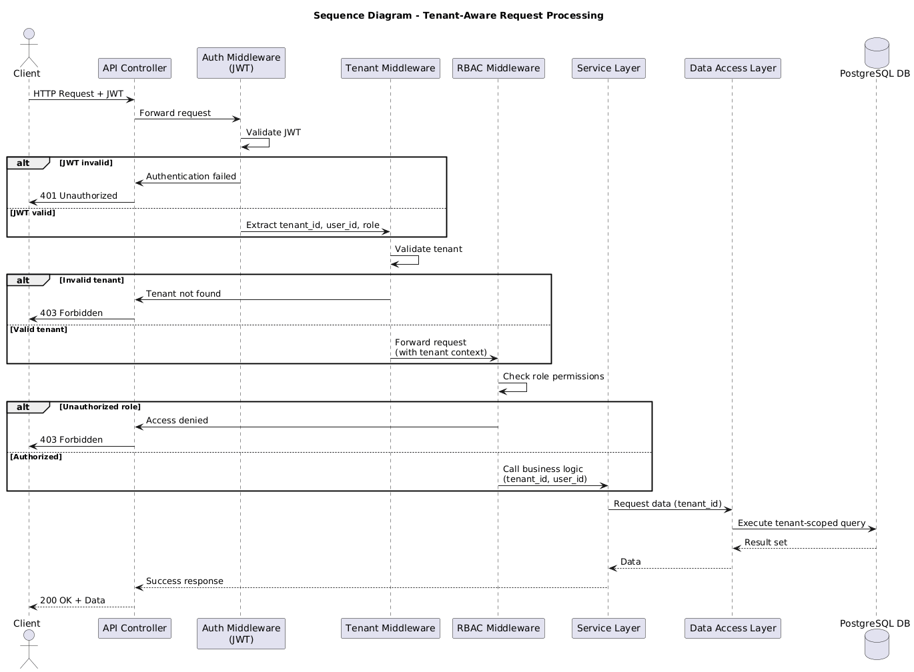

# Multi-Tenant SaaS Backend Architecture

## 📌 Overview

This project demonstrates the design of a **scalable multi-tenant SaaS backend** where multiple organizations (tenants) operate on a shared infrastructure while maintaining **strict data isolation and security**.

The focus of this project is on **architecture and system design**, following real-world SaaS patterns used in production systems.

---

## 🎯 Key Objectives

- Support multiple organizations on shared infrastructure
- Enforce strict tenant-level data isolation
- Implement secure authentication and authorization
- Design a scalable, maintainable backend architecture

---

## 🧱 High-Level Architecture

The system follows a layered architecture with strong middleware-driven enforcement of security and tenant isolation.

  

**Core Layers**

- Client Layer
- API Controller Layer
- Authentication Middleware (JWT)
- Tenant Resolution Middleware
- Authorization Middleware (RBAC)
- Service / Business Logic Layer
- Data Access Layer
- PostgreSQL Database

---

## 🔐 Authentication & Authorization

- Stateless **JWT-based authentication**
- **Role-Based Access Control (RBAC)** to restrict operations by role
- JWT payload includes:
  - `user_id`
  - `tenant_id`
  - `role`

Unauthorized or unauthenticated requests are rejected early in the request lifecycle.

---

## 🏢 Multi-Tenancy & Data Isolation

This system uses a **shared-database, shared-schema** multi-tenancy model.

**Isolation Strategy**

- Every request is resolved to exactly one tenant
- Tenant context is enforced via middleware
- All database queries are scoped using a `tenant_id` discriminator
- Cross-tenant data access is prevented by design

---

## 🔁 Request Workflow

The following workflow illustrates how a request is processed end-to-end in a tenant-aware manner.

  

**Workflow Steps**

1. Client sends request with JWT token
2. JWT is validated
3. Tenant context is resolved
4. RBAC permissions are verified
5. Business logic executes with tenant scope
6. Tenant-scoped database queries are executed
7. Response is returned to the client

---

## 🔄 Sequence Diagram

The sequence diagram below shows the **exact execution order** of components for a tenant-scoped API request, highlighting authentication, tenant resolution, authorization, and database access.

  

This diagram clearly demonstrates how tenant isolation is preserved throughout the request lifecycle.

---

## 🛢️ Database Design

- PostgreSQL is used as the primary database
- Shared tables with tenant discrimination
- Normalized schema for data integrity
- Designed to support horizontal scaling with stateless APIs

---

## ⚙️ Tech Stack

- **Backend:** (as finalized on Day 1)
- **Authentication:** JWT
- **Authorization:** RBAC
- **Database:** PostgreSQL
- **Architecture Style:** Layered Monolithic (SaaS-ready)

---

## 🚀 Scalability Considerations

The architecture supports:

- Horizontal scaling of API services
- Easy integration of caching layers
- Background job processing
- Read replicas for database scaling

The system is designed to evolve without major architectural changes.

---

## 📈 Why This Project

This project highlights:

- Real-world SaaS architecture design
- Secure backend engineering practices
- Strong separation of concerns
- Interview-ready system design documentation

This is a **resume-grade backend architecture project**, not a basic CRUD application.

---

## 📌 Current Status

Architecture and design phase complete.  
Implementation will follow with Low-Level Design (LLD) and database schema definition.
