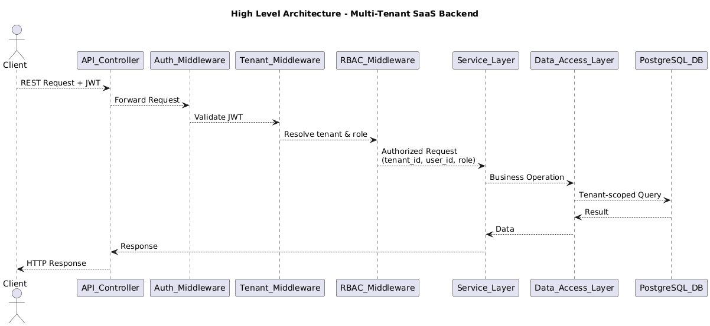
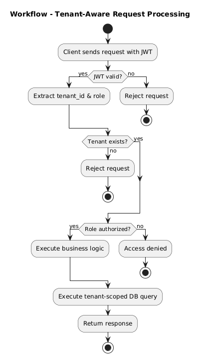
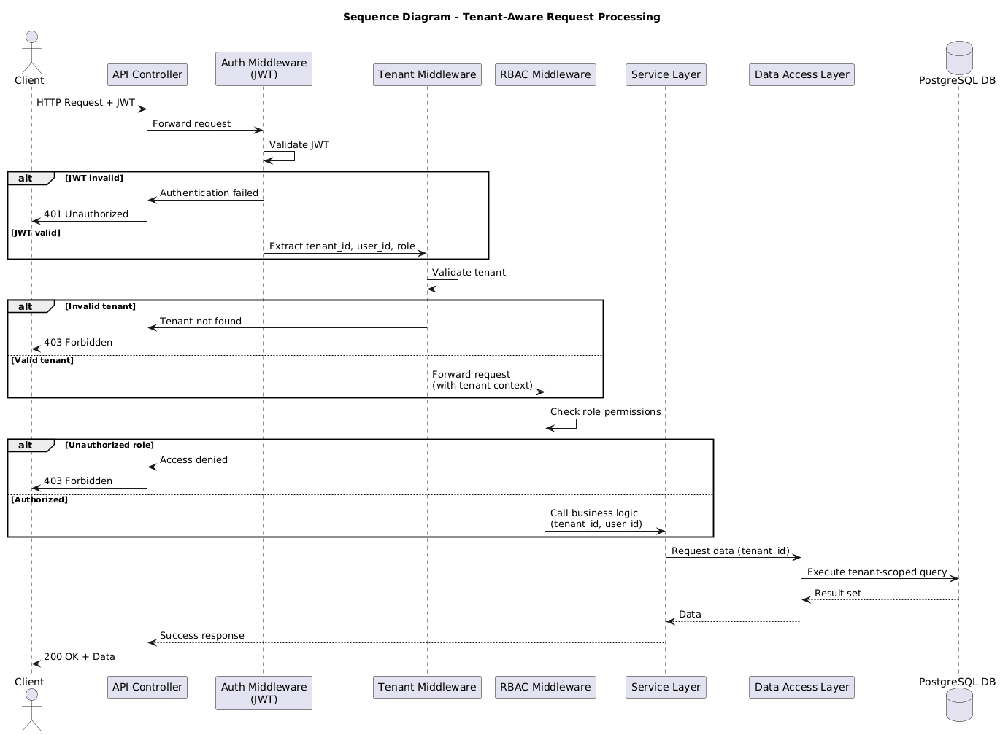

# Project Aegis — Multi-Tenant Project Management SaaS

Project Aegis is a multi-tenant project-management SaaS application built around a shared PostgreSQL database and shared schema, with UUID identifiers, JWT authentication, RBAC, tenant-context middleware, tenant-scoped queries, and audit logging.

The repository contains the FastAPI backend and a React/Vite GUI for demonstrating the system end-to-end.

## Architecture



**Request flow:**

Client → JWT Authentication → Tenant Context Middleware → RBAC → Business/API Layer → SQLAlchemy → PostgreSQL



Tenant-owned resources are scoped to the authenticated user's `tenant_id`. Protected reads and writes validate tenant ownership before returning or modifying data.



The original architecture diagrams and schema document are retained under `docs/`.

## Features

### Backend

- Tenant registration with an initial Owner account
- JWT login and stateless authentication
- Owner / Admin / Member RBAC
- Backend-enforced authorization
- Tenant context middleware
- Tenant-isolated project and task access
- Project descriptions, managers, membership, lifecycle and archiving
- Collaborative tasks with multiple collaborators
- Task status, description and priority (`high`, `medium`, `low`)
- Task comments
- Workspace user management and role administration
- Active / inactive user handling
- Audit logs for security-relevant mutations
- Tenant verification endpoint
- Soft-delete support on users
- SQLAlchemy UUID-based domain model
- PostgreSQL Docker development stack
- Health and database connectivity endpoints
- Automated API tests for authentication, CRUD flow, RBAC, task permissions and tenant isolation
- Interactive OpenAPI documentation

### GUI

The `frontend/` application provides:

- Login and workspace registration
- Role-aware workspace dashboard
- Live workspace analytics for task status, task priority, project lifecycle and team status
- Project creation and editing
- Project member management
- Archived-project read-only views
- Task creation and editing
- Task priority ordering and collaboration controls
- Team and role management
- Active / inactive user visibility
- Tenant verification
- Audit log viewing for Owners/Admins
- Responsive layout

The GUI uses the same FastAPI API as every other client. Tenant isolation and authorization remain backend-enforced rather than being trusted to the browser.

## RBAC Permissions

| Capability | Owner | Admin | Member |
|---|:---:|:---:|:---:|
| View permitted workspace data | ✓ | ✓ | ✓ |
| Manage Admin users | ✓ | — | — |
| Manage Member users | ✓ | ✓ | — |
| Create projects | ✓ | ✓ | — |
| Create tasks | ✓ | ✓ | — |
| Update permitted tasks | ✓ | ✓ | Own/assigned/collaborative |
| View audit logs | ✓ | ✓ | — |
| Verify tenant context | ✓ | ✓ | ✓ |

Members only receive projects they are assigned to and tasks in those projects that they participate in. The API enforces these rules independently of the GUI.

## Database Model

The schema follows the original Aegis design:

`Tenant → User / Role → Project → ProjectMember → Task → Comment`

with `AuditLog` recording security-relevant actions.

The complete schema is documented in [`docs/schema_v1.md`](docs/schema_v1.md).

## Project Structure

```text
.
├── app/
│   ├── api/                 # API routes, dependencies and authorization
│   ├── core/                # Configuration, security and assignment guards
│   ├── db/                  # SQLAlchemy engine, session and initialization
│   ├── middleware/          # Tenant context middleware
│   ├── models/              # SQLAlchemy domain models
│   ├── main.py              # FastAPI application entry point
│   └── schemas.py           # Pydantic request/response schemas
├── docs/
│   ├── images/              # HLD, workflow and sequence diagrams
│   ├── aegis-workflow.md    # Application workflow documentation
│   └── schema_v1.md         # Schema/design document
├── frontend/                # React/Vite GUI and dashboard analytics
├── tests/                   # API, RBAC and tenant-isolation tests
├── .github/workflows/       # GitHub Actions CI
├── Dockerfile               # Backend container
├── docker-compose.yml       # PostgreSQL + API + frontend
├── .env.example             # Backend environment template
└── requirements.txt         # Python dependencies
```

## Run the Complete Application with Docker

```bash
git clone https://github.com/ShashwatSolanki/multi-tenant-saas-backend.git
cd multi-tenant-saas-backend
docker compose up --build
```

Services:

| Service | Purpose |
|---|---|
| Frontend | React/Vite Aegis GUI on port 5173 |
| API | FastAPI backend on port 8000 |
| Swagger | Interactive API documentation at `/docs` |
| Database | PostgreSQL on port 5432 |

Open the frontend, register a workspace, and sign in as the Owner.

### Suggested demo flow

1. Register a workspace.
2. Add an Admin and Member from **Team & roles**.
3. Create a project with a description and manager.
4. Add project members and create tasks with priority, assignee and collaborators.
5. Use the dashboard analytics to show task status, priority, project lifecycle and team status.
6. Demonstrate Member visibility and task permissions with the Member account.
7. Archive a project and demonstrate its read-only behavior.
8. Open **Tenant verification** and verify the authenticated tenant context.
9. Open **Audit logs** as Owner/Admin.

## Run Backend Without Docker

Create a virtual environment, install dependencies, and configure `.env` from `.env.example`.

```bash
python -m venv .venv

# Windows
.venv\Scripts\activate

# macOS/Linux
source .venv/bin/activate

pip install -r requirements.txt
uvicorn app.main:app --reload
```

For the intended architecture, configure PostgreSQL through `DATABASE_URL`. The test suite uses a temporary SQLite database where appropriate.

## Run Frontend Without Docker

```bash
cd frontend
npm install
npm run dev
```

The Vite development server runs at `http://localhost:5173` and connects to `http://localhost:8000/api/v1` by default.

## Core API

| Method | Endpoint | Purpose |
|---|---|---|
| POST | `/api/v1/auth/register` | Create tenant + Owner |
| POST | `/api/v1/auth/login` | Obtain JWT |
| GET | `/api/v1/me` | Current authenticated user and role |
| GET | `/api/v1/tenant` | Verify current tenant context |
| POST | `/api/v1/users` | Create tenant user according to RBAC |
| GET | `/api/v1/users` | List permitted tenant users |
| PATCH | `/api/v1/users/{user_id}` | Owner role/status administration |
| POST | `/api/v1/projects` | Create project |
| GET | `/api/v1/projects` | List permitted projects |
| GET | `/api/v1/projects/{project_id}` | Get permitted project |
| POST | `/api/v1/projects/{project_id}/tasks` | Create task |
| GET | `/api/v1/projects/{project_id}/tasks` | List permitted project tasks |
| PATCH | `/api/v1/tasks/{task_id}` | Update task according to RBAC |
| PUT | `/api/v1/tasks/{task_id}/collaborators` | Manage task collaborators |
| POST | `/api/v1/tasks/{task_id}/comments` | Add comment |
| GET | `/api/v1/tasks/{task_id}/comments` | List comments |
| GET | `/api/v1/audit-logs` | Owner/Admin audit view |

## Security and Tenant Isolation

A JWT carries `user_id`, `tenant_id`, and `role`. Protected requests validate the token and load the user using both user ID and tenant ID. Tenant-owned reads and writes additionally constrain the tenant ID.

Members have restricted workspace visibility: they see assigned projects and only the tasks in those projects that they participate in as an assignee, creator or collaborator. Owners and Admins have tenant-wide management visibility within their tenant.

The `/api/v1/tenant` endpoint explicitly verifies that the authenticated JWT tenant identity resolves to the corresponding database tenant and that the current user belongs to it.

Inactive users cannot authenticate or be selected for new project/task assignments.

## Tests and CI

Run the backend test suite with:

```bash
python -m pytest -q
```

The tests cover authentication, tenant verification, user/role management, project and task flows, RBAC enforcement, comments and cross-tenant isolation.

GitHub Actions runs the backend test suite and a production frontend build on pushes and pull requests targeting `main`.

## Original Design Documents

- `docs/schema_v1.md` — schema and entity design
- `docs/images/hld.png` — high-level architecture
- `docs/images/workflow.png` — workflow/request flow
- `docs/images/sequence.png` — sequence diagram
- `docs/aegis-workflow.md` — application workflow and authorization flow

## Project Status

**Aegis MVP implementation complete.** The repository contains the backend, GUI, database setup, authentication, RBAC, tenant isolation, tenant-context verification, collaborative tasks, audit logging, dashboard analytics, tests, Docker configuration, CI workflow, and original design documentation.
