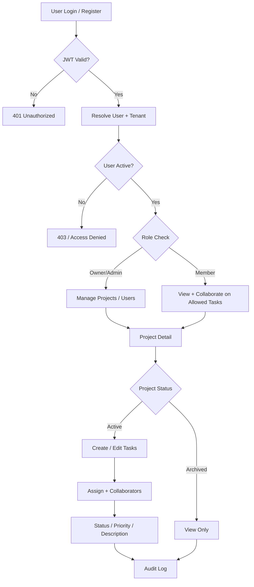
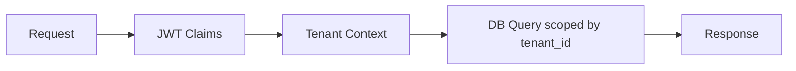

# Project Aegis — Application Workflow

```mermaid
flowchart TD
    A[User Login / Register] --> B{JWT Valid?}
    B -- No --> C[401 Unauthorized]
    B -- Yes --> D[Resolve User + Tenant]
    D --> E{User Active?}
    E -- No --> F[403 / Access Denied]
    E -- Yes --> G{Role Check}
    G -->|Owner/Admin| H[Manage Projects / Users]
    G -->|Member| I[View + Collaborate on Allowed Tasks]
    H --> J[Project Detail]
    I --> J
    J --> K{Project Status}
    K -->|Active| L[Create / Edit Tasks]
    K -->|Archived| M[View Only]
    L --> N[Assign + Collaborators]
    N --> O[Status / Priority / Description]
    O --> P[Audit Log]
    M --> P
```

## Tenant isolation

```mermaid
flowchart LR
    R[Request] --> JWT[JWT Claims]
    JWT --> T[Tenant Context]
    T --> Q[DB Query scoped by tenant_id]
    Q --> X[Response]
```
